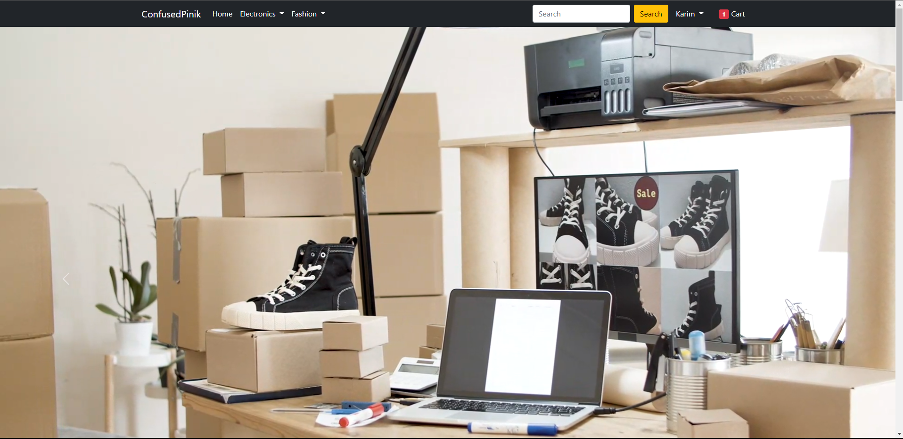

This is a fully functional Ecommerce website implemented by Django.
try it youself - http://ecommercepinik.pythonanywhere.com/


To run the project in your machine

Install virtual environment:
```
pip install virtualenv
```
Create your own environment
```
virtualenv yourenv
```
Activate your environemnt
```
yourenv\Scripts\activate
```
Now install requirements.txt
```
requirements.txt
```
